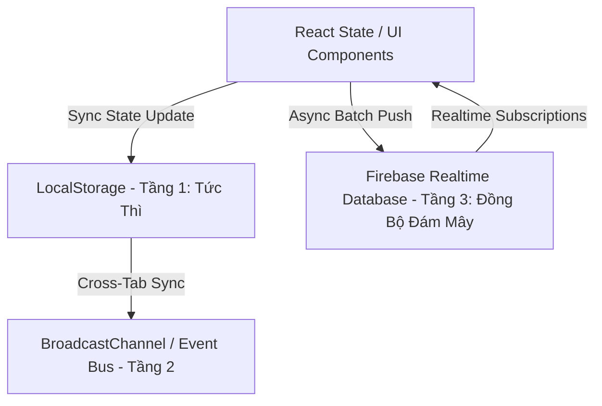
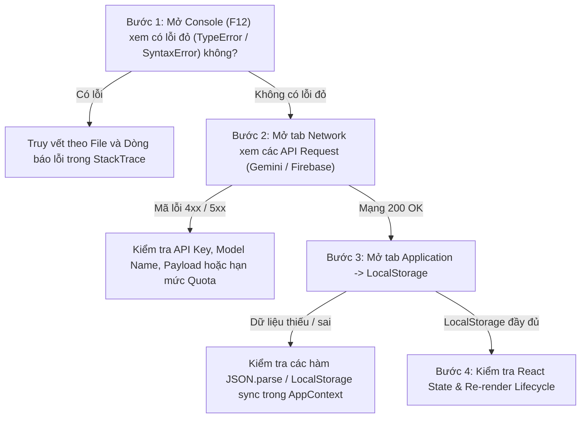

# 📘 TÀI LIỆU HỆ THỐNG VÀ CẨM NANG XÁC ĐỊNH LỖI (SYSTEM MANUAL & DEBUGGING GUIDE)
> **Hệ thống Luyện thi Tuyển sinh vào Lớp 10 (Toán & Tiếng Anh)**
> **Phiên bản kiến trúc:** v2.5 Hybrid Cloud-Sync & Offline-First

---

## 📑 MỤC LỤC
1. [Kiến Trúc Tổng Thể & Luồng Dữ Liệu (Architecture & Data Flow)](#1-kiến-trúc-tổng-thể--luồng-dữ-liệu)
2. [Chi Tiết Từng Module Chức Năng (Feature Breakdown)](#2-chi-tiết-từng-module-chức-năng)
   - [2.1. Sinh Đề & Câu Hỏi Bằng AI (AI Generation Engine)](#21-sinh-đề--câu-hỏi-bằng-ai)
   - [2.2. Phòng Thi Thử Chuẩn Cấu Trúc (Exam Simulator)](#22-phòng-thi-thử-chuẩn-cấu-trúc)
   - [2.3. Luyện Tập Chuyên Đề & Luyện Phản Xạ Nhanh (Topic & Quick Blitz)](#23-luyện-tập-chuyên-đề--luyện-phản-xạ-nhanh)
   - [2.4. Sổ Tay Lỗi Sai Thông Minh (Smart Mistake Notebook)](#24-sổ-tay-lỗi-sai-thông-minh)
   - [2.5. Phân Tích Năng Lực & Dự Báo Điểm Thi (Analytics & AI Score Prediction)](#25-phân-tích-năng-lực--dự-báo-điểm-thi)
   - [2.6. Flashcards Từ Vựng Trọng Tâm & Phát Âm (Vocabulary Trainer)](#26-flashcards-từ-vựng-trọng-tâm--phát-âm)
   - [2.7. Bảng Quản Trị Giáo Viên & Giám Sát Thời Gian Thực (Admin & Live Guardian)](#27-bảng-quản-trị-giáo-viên--giám-sát-thời-gian-thực)
   - [2.8. Trích Xuất Đề Thi & OCR Ảnh (OCR & File Extraction Engine)](#28-trích-xuất-đề-thi--ocr-ảnh)
3. [Cẩm Nang Truy Vết & Xác Định Lỗi Hệ Thống (Debugging Playbook)](#3-cẩm-nang-truy-vết--xác-định-lỗi-hệ-thống)
4. [Bảng Tra Cứu Sự Cố Nhanh (Troubleshooting Matrix)](#4-bảng-tra-cứu-sự-cố-nhanh)

---

## 1. KIẾN TRÚC TỔNG THỂ & LUỒNG DỮ LIỆU

Hệ thống hoạt động theo mô hình **3 lớp dự phòng (3-Tier Redundancy)** đảm bảo không bao giờ mất dữ liệu học tập của học sinh:



### Các Khóa Dữ Liệu Trong `localStorage`:
*   `edu10_currentUser`: Thông tin tài khoản người dùng hiện tại đang đăng nhập.
*   `edu10_userdata_{userId}`: Toàn bộ lịch sử làm bài (`examAttempts`), bài luyện tập (`practiceSessions`), sổ tay lỗi sai (`mistakes`), đánh dấu bookmark (`bookmarks`) của từng học sinh.
*   `edu10_custom_questions`: Danh sách câu hỏi tự tạo hoặc được sinh từ AI.
*   `edu10_global_custom_exams`: Danh sách các đề thi được tạo để toàn bộ học sinh có thể thấy.
*   `edu10_gemini_api_key`: API Key Gemini AI của người dùng/giáo viên.
*   `edu10_deleted_question_ids` / `edu10_deleted_exam_ids`: Danh sách ID đã xóa vĩnh viễn (Blacklist).

---

## 2. CHI TIẾT TỪNG MODULE CHỨC NĂNG

---

### 2.1. Sinh Đề & Câu Hỏi Bằng AI
*   **File chính:** [`src/services/aiExamService.ts`](file:///c:/Users/nhhag/Downloads/eduenglish-10---luy%E1%BB%87n-thi-v%C3%A0o-l%E1%BB%9Bp-10/src/services/aiExamService.ts), [`src/components/student/AiExamGeneratorView.tsx`](file:///c:/Users/nhhag/Downloads/eduenglish-10---luy%E1%BB%87n-thi-v%C3%A0o-l%E1%BB%9Bp-10/src/components/student/AiExamGeneratorView.tsx)
*   **Cơ chế hoạt động:**
    1. Người dùng chọn Môn (Toán/Anh), Độ khó (Cơ bản/Khá-Giỏi/Chuyên), Số câu (10, 20, 30, 40 câu), Chuyên đề trọng tâm, và Model AI (Mặc định: `gemini-3.5-flash-lite`).
    2. Prompt được thiết kế chuẩn sư phạm thi vào 10, yêu cầu trả về định dạng JSON thuần.
    3. Hàm `callGeminiApiWithFallback` gọi API: nếu model chính bị quá tải (HTTP 429/503) hoặc lỗi, hệ thống tự động chuyển (failover) tuần tự qua các model tiếp theo: `gemini-3.5-flash-lite` $\rightarrow$ `gemini-2.0-flash` $\rightarrow$ `gemini-1.5-flash` $\rightarrow$ `gemini-3.6-flash`.
    4. Trình phân tích `tryParseOrRepairExamJson` làm sạch markdown tag (````json...````), sửa lỗi cú pháp JSON nếu AI trả về thiếu ngoặc.
    5. Sau khi tạo thành công, câu hỏi được nạp vào hệ thống qua `bulkImportQuestions`, đề thi được lưu qua `addExam`.
*   **Cách xác định lỗi khi có sự cố:**
    *   *AI không sinh đề:* Mở DevTools (F12) $\rightarrow$ Tab **Network** $\rightarrow$ Tìm request `generateContent`. Xem mã phản hồi HTTP:
        *   `400`: Prompt hoặc định dạng JSON gửi lên bị sai.
        *   `403` / `404`: API Key sai hoặc model ID không hỗ trợ trên key đó.
        *   `429`: Quá hạn mức request $\rightarrow$ Kiểm tra xem cơ chế Fallback có nhảy sang model khác không.
    *   *Sinh 40 câu nhưng báo không có câu hỏi khi làm bài:* Kiểm tra xem `getQuestionById` có tìm thấy ID câu hỏi trong `localStorage.getItem('edu10_custom_questions')` hay không.

---

### 2.2. Phòng Thi Thử Chuẩn Cấu Trúc
*   **File chính:** [`src/components/student/ExamSimulatorView.tsx`](file:///c:/Users/nhhag/Downloads/eduenglish-10---luy%E1%BB%87n-thi-v%C3%A0o-l%E1%BB%9Bp-10/src/components/student/ExamSimulatorView.tsx)
*   **Cơ chế hoạt động:**
    1. Hiển thị đề thi chính thức của các Sở GD&ĐT (Hà Nội, TP.HCM, Đà Nẵng,...) và đề AI/Giáo viên tạo.
    2. **Bộ đếm thời gian độc lập:** Dùng `setInterval` đếm lùi, khi hết giờ tự động nộp bài mà không gây trôi lệch giây.
    3. **Chống gian lận (Anti-Cheat):** Bắt sự kiện `visibilitychange`. Nếu học sinh chuyển tab sang Google tra tài liệu, hệ thống đếm số lần và phát cảnh báo trực tiếp về Dashboard của Giáo viên/Phụ huynh qua Firebase Realtime.
    4. **Chấm điểm & Lưu kết quả:**
        *   Tính thang điểm 10 và phần trăm đúng.
        *   Lưu lịch sử vào `examAttempts`.
        *   Tự động ghi nhận tất cả các câu làm sai và câu bỏ qua vào Sổ tay lỗi sai trong 1 batch duy nhất (`recordMultipleAnswerResults`).
        *   Có cờ `isSubmittingRef` chống click đúp nộp bài trùng lặp.
*   **Cách xác định lỗi khi có sự cố:**
    *   *Bấm nộp bài không chuyển sang màn hình kết quả:* Mở Console xem có lỗi runtime trong `saveExamAttempt` không.
    *   *Đề thi trống không có câu hỏi:* Kiểm tra `exam.questionIds` xem các ID câu hỏi có tồn tại trong `QUESTIONS_DATA`, `MATH_QUESTIONS_DATA` hoặc `customQuestions` không.

---

### 2.3. Luyện Tập Chuyên Đề & Luyện Phản Xạ Nhanh
*   **File chính:** [`src/components/student/TopicPracticeView.tsx`](file:///c:/Users/nhhag/Downloads/eduenglish-10---luy%E1%BB%87n-thi-v%C3%A0o-l%E1%BB%9Bp-10/src/components/student/TopicPracticeView.tsx), [`src/components/student/QuickBlitzView.tsx`](file:///c:/Users/nhhag/Downloads/eduenglish-10---luy%E1%BB%87n-thi-v%C3%A0o-l%E1%BB%9Bp-10/src/components/student/QuickBlitzView.tsx)
*   **Cơ chế hoạt động:**
    1. **Luyện Chuyên Đề:** Phân loại theo 10 chủ điểm Ngữ pháp Tiếng Anh và 10 chuyên đề Toán học. Có nút tạo thêm câu hỏi theo từng chuyên đề bằng AI. Học sinh có thể bấm "Kiểm tra đáp án" để xem giải thích tức thì.
    2. **Luyện Nhanh Phản Xạ (Quick Blitz):** Lấy ngẫu nhiên 10 câu hỏi tổng hợp, trả lời nhanh để tăng tốc độ làm bài.
    3. Khi hoàn tất, ghi nhận vào `practiceSessions` và cập nhật chỉ số năng lực.
*   **Cách xác định lỗi khi có sự cố:**
    *   *Crash khi bấm hoàn thành Quick Blitz:* Kiểm tra `session.topicId` trong `savePracticeSession` xem có bị gọi `.replace()` trên biến `undefined` hay không (Đã được bảo vệ với fallback `'Tổng hợp phản xạ'`).

---

### 2.4. Sổ Tay Lỗi Sai Thông Minh
*   **File chính:** [`src/components/student/MistakeNotebookView.tsx`](file:///c:/Users/nhhag/Downloads/eduenglish-10---luy%E1%BB%87n-thi-v%C3%A0o-l%E1%BB%9Bp-10/src/components/student/MistakeNotebookView.tsx)
*   **Cơ chế hoạt động:**
    1. Tự động thu thập tất cả câu hỏi học sinh làm sai từ mọi nguồn (Thi thử, Luyện chuyên đề, Quick Blitz).
    2. **Thuật toán Spaced Repetition (Lặp lại ngắt quãng):**
        *   Mỗi câu sai có biến đếm `consecutiveCorrect` (số lần làm đúng liên tiếp).
        *   Khi làm lại đúng **2 lần liên tiếp** ($consecutiveCorrect \ge 2$), câu hỏi được đánh dấu `mastered: true` (Đã khắc phục hoàn toàn).
        *   Nếu làm sai lại dù chỉ 1 lần $\rightarrow$ `consecutiveCorrect` reset về `0` và `mastered: false`.
    3. Học sinh có thể viết ghi chú cá nhân (`userNote`) cho từng câu để ghi nhớ bẫy đề thi.
*   **Cách xác định lỗi khi có sự cố:**
    *   *Số lần sai bị nhân đôi (+2 thay vì +1):* Kiểm tra xem câu hỏi có bị gọi `recordAnswerResult` 2 lần ở cả component và `savePracticeSession` hay không.

---

### 2.5. Phân Tích Năng Lực & Dự Báo Điểm Thi
*   **File chính:** [`src/components/student/AnalyticsView.tsx`](file:///c:/Users/nhhag/Downloads/eduenglish-10---luy%E1%BB%87n-thi-v%C3%A0o-l%E1%BB%9Bp-10/src/components/student/AnalyticsView.tsx)
*   **Cơ chế hoạt động:**
    1. Tính toán tỉ lệ chính xác và mức độ thành thạo trên từng chuyên đề Toán và Tiếng Anh.
    2. Dự báo điểm thi vào 10 dựa trên điểm số trung bình có trọng số của các lần thi gần nhất và tỉ lệ lấp lỗ hổng kiến thức.
    3. Chỉ ra chuyên đề yếu nhất (Weakest Topics) cần ưu tiên ôn tập gấp.
*   **Cách xác định lỗi khi có sự cố:**
    *   *Biểu đồ không hiển thị:* Kiểm tra xem học sinh đã có ít nhất 1 `examAttempt` hoặc `practiceSession` chưa.

---

### 2.6. Flashcards Từ Vựng Trọng Tâm & Phát Âm
*   **File chính:** [`src/components/student/VocabFlashcardsView.tsx`](file:///c:/Users/nhhag/Downloads/eduenglish-10---luy%E1%BB%87n-thi-v%C3%A0o-l%E1%BB%9Bp-10/src/components/student/VocabFlashcardsView.tsx)
*   **Cơ chế hoạt động:**
    1. Cung cấp 8 bộ từ vựng trọng điểm vào lớp 10 (Môi trường, Giáo dục, Công nghệ, Đô thị hóa,...).
    2. Lật thẻ flashcard xem phiên âm IPA, nghĩa tiếng Việt, câu ví dụ và từ đồng nghĩa.
    3. **Phát âm chuẩn bản xứ:** Sử dụng trình duyệt `window.speechSynthesis` với giọng đọc tiếng Anh (`en-US` hoặc `en-GB`).
*   **Cách xác định lỗi khi có sự cố:**
    *   *Bấm nút loa không phát ra âm thanh:* Kiểm tra xem trình duyệt có chặn Auto-play âm thanh hoặc hệ thống có cài đặt giọng đọc `speechSynthesis` hay không.

---

### 2.7. Bảng Quản Trị Giáo Viên & Giám Sát Thời Gian Thực
*   **File chính:** [`src/components/admin/AdminPanel.tsx`](file:///c:/Users/nhhag/Downloads/eduenglish-10---luy%E1%BB%87n-thi-v%C3%A0o-l%E1%BB%9Bp-10/src/components/admin/AdminPanel.tsx)
*   **Cơ chế hoạt động:**
    1. **Live Activity Stream:** Lắng nghe kênh sự kiện Firebase Realtime, hiển thị thông báo tức thì khi học sinh: bắt đầu thi, nộp bài (kèm điểm số), làm sai câu hỏi, hoặc gian lận chuyển tab.
    2. **Giao Bài Tập (Assign Tasks):** Giáo viên giao bài thi hoặc chuyên đề cho từng học sinh với thời hạn nộp bài (Deadline).
    3. **Quản Lý Đề & Câu Hỏi:** Soạn câu hỏi thủ công, import hàng loạt, tạo đề tự động bằng AI, trích xuất từ file Word/PDF.
*   **Cách xác định lỗi khi có sự cố:**
    *   *Giáo viên không nhận được thông báo nộp bài của học sinh:* Kiểm tra kết nối Firebase Realtime DB và console xem có lỗi `PERMISSON_DENIED` không.

---

### 2.8. Trích Xuất Đề Thi & OCR Ảnh
*   **File chính:** [`src/services/fileReaderService.ts`](file:///c:/Users/nhhag/Downloads/eduenglish-10---luy%E1%BB%87n-thi-v%C3%A0o-l%E1%BB%9Bp-10/src/services/fileReaderService.ts)
*   **Cơ chế hoạt động:**
    1. **File .txt / .md:** Đọc trực tiếp bằng `FileReader`.
    2. **File .pdf:** Dùng thư viện `pdfjs-dist` trích xuất text từng trang. Nếu PDF là dạng scan ảnh, tự động chuyển sang OCR.
    3. **File .docx:** Dùng thư viện `mammoth` trích xuất nội dung văn bản.
    4. **File Ảnh (.jpg, .png, .webp):** Chuyển ảnh thành base64 và gửi lên **Gemini Vision** để OCR nhận diện đề thi chính xác.
*   **Cách xác định lỗi khi có sự cố:**
    *   *File PDF hoặc DOCX không đọc được:* Kiểm tra file có bị mã hóa mật khẩu hoặc định dạng `.doc` cũ (chỉ hỗ trợ `.docx`).

---

## 3. CẨM NANG TRUY VẾT & XÁC ĐỊNH LỖI HỆ THỐNG (DEBUGGING PLAYBOOK)

Khi gặp bất kỳ sự cố nào trong quá trình vận hành, thực hiện theo quy trình 4 bước sau để khoanh vùng chính xác:



### Lệnh Kiểm Tra Nhanh Trong Terminal:
```bash
# 1. Kiểm tra toàn bộ kiểu dữ liệu và cú pháp TypeScript
npm run lint

# 2. Kiểm tra đóng gói toàn bộ ứng dụng Production
npm run build

# 3. Khởi chạy môi trường Dev để debug trực quan
npm run dev
```

---

## 4. BẢNG TRA CỨU SỰ CỐ NHANH (TROUBLESHOOTING MATRIX)

| Triệu chứng | Vị trí nghi vấn | Nguyên nhân khả dĩ | Cách khắc phục ngay |
|---|---|---|---|
| **Báo "Không có câu hỏi hợp lệ" khi bấm làm bài** | [`ExamSimulatorView.tsx`](file:///c:/Users/nhhag/Downloads/eduenglish-10---luy%E1%BB%87n-thi-v%C3%A0o-l%E1%BB%9Bp-10/src/components/student/ExamSimulatorView.tsx) / [`AppContext.tsx`](file:///c:/Users/nhhag/Downloads/eduenglish-10---luy%E1%BB%87n-thi-v%C3%A0o-l%E1%BB%9Bp-10/src/context/AppContext.tsx) | `getQuestionById` chưa kịp load từ state sau khi import câu hỏi | Đã có fallback đọc trực tiếp `localStorage.getItem('edu10_custom_questions')` và retry 150ms. |
| **AI báo lỗi "Quota exceeded" hoặc 429** | [`aiExamService.ts`](file:///c:/Users/nhhag/Downloads/eduenglish-10---luy%E1%BB%87n-thi-v%C3%A0o-l%E1%BB%9Bp-10/src/services/aiExamService.ts) | Model bị giới hạn số lượt gọi/phút | Hệ thống tự động chuyển model tiếp theo (`gemini-3.5-flash-lite`, `gemini-2.0-flash`,...). |
| **Trắng màn hình khi nộp bài Luyện tập** | [`AppContext.tsx`](file:///c:/Users/nhhag/Downloads/eduenglish-10---luy%E1%BB%87n-thi-v%C3%A0o-l%E1%BB%9Bp-10/src/context/AppContext.tsx) | `session.topicId` bị `undefined` khi luyện Quick Blitz | Đã fix với `topicLabel` dự phòng an toàn. |
| **Số lần làm sai bị nhân đôi trong Sổ tay** | [`QuickBlitzView.tsx`](file:///c:/Users/nhhag/Downloads/eduenglish-10---luy%E1%BB%87n-thi-v%C3%A0o-l%E1%BB%9Bp-10/src/components/student/QuickBlitzView.tsx) | Gọi `recordAnswerResult` cả lúc click chọn và lúc kết thúc | Đã loại bỏ vòng lặp duyệt trùng trong `savePracticeSession`. |
| **Hai tab trình duyệt không đồng bộ câu hỏi** | [`AppContext.tsx`](file:///c:/Users/nhhag/Downloads/eduenglish-10---luy%E1%BB%87n-thi-v%C3%A0o-l%E1%BB%9Bp-10/src/context/AppContext.tsx) | `dispatchGlobalSync` phát trước khi `localStorage` kịp ghi | Đã đưa lệnh ghi `localStorage` chạy đồng bộ trước khi phát event. |
